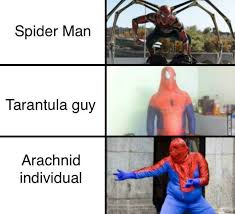

# Asher's user page

## About myself

Hello people. This is **Asher James**. I am a second year undergraduate studying in the * *University of California, San Diego* *. 

I am ~~absolutely~~ absolutely not looking forward to this quarter. My scheduled is stacked and I am thinking about dropping some classes. But as a wise man once said,:

> You gotta deal with it, son. 
I really don't know who said this quote.

## Some code I just written in CSE 100

This is the code-snippet of something I written in CSE 100.

```
void FancyOutputStream::write_bit(int bit) {
    // crash if invalid input
    if(bit != 0 && bit != 1) {
        error("Trying to write invalid bit");
    }
    ........
}
```

## Favorite Youtube Video

My favorite Youtube Video is this [Video](https://www.youtube.com/watch?v=BBJa32lCaaY). This video has always acted as an inspiration whenever I was going through tough times.


[Link](#some-code-i-just-written-in-cse-100)


## Some pictures love


[This is my implementation of a relative link.](relativelink.md)

## What do I hope to do in this class 

- Learn the overall process of creating a program 
- Learn how software engineers operate
- Just learn to push past my comfort zone

## How I hope to succeed in this class

1. Always ask help from TA's
2. Always try my level best
3. Learn when to take a breather and then come back to solve task at hand


## Stuff I wanted to achieve this quarter

- [x] Smash squat Personal Best#739
- [ ] Increase GPA
- [ ] Enjoy life


